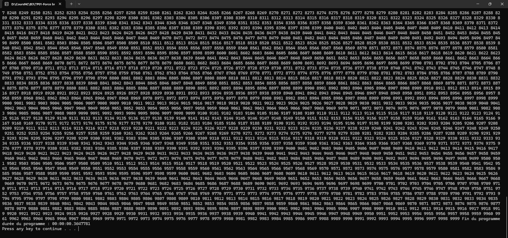

1) Durée du programme en secondes: 0.0187083 secondes.
2) Durée du programme en ms: 18.7083 millisecondes.
---
3) 

4) Durée du programme en secondes: 0.3647781 secondes.
---
5) Durée du programme en secondes avec une temporisation de 5 millisecondes: 57.9681880 secondes.
6) L'attaquant va être grandement ralenti sur sa tentative d'attaque car le programme va le forcer à attendre 1 seconde avant chaque nouvelle tentative.
---
