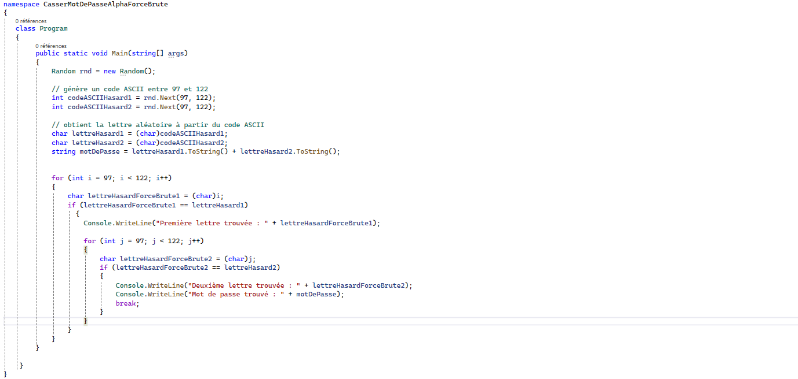

#1. Table ASCII
1) ASCII 97 correspond au caractère "a".
2) Il s'affiche dans la console le caractère correponsant au code ASCII 97.
---
#2. Création d'un mot de passe

3) Il s'affiche dans la console les caractères correpspondant à chacun des codes ASCII.

---
#3. Afficher toutes les lettres minuscules

4) 

---
#4. Générer un mot de passe d'une lettre et la retrouver

5)

---
#5. Idem que précédemment mais avec 2 lettres

6)

